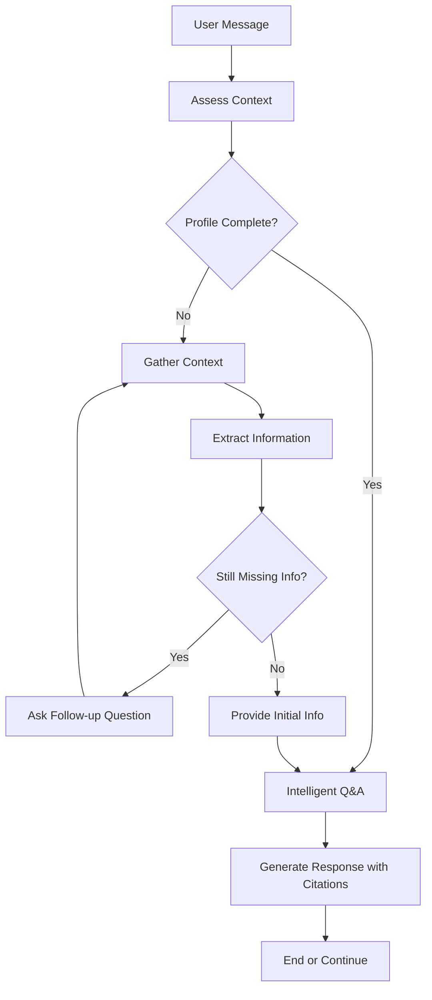

# Mandry AI - Intelligent Visa Assistant

Mandry AI is a comprehensive visa assistance platform that combines intelligent conversation flows with real-time government data verification to help users navigate complex visa processes. The platform features an AI-powered chat assistant, document processing capabilities, and intelligent reminder scheduling.

## 🚀 Getting Started

### Local Development Setup

#### Prerequisites
- Node.js 18+ and npm
- Python 3.8+
- Git

#### Frontend Setup
1. Navigate to the project root directory
2. Install frontend dependencies:
   ```bash
   npm install
   ```
3. Start the development server:
   ```bash
   npm run dev
   ```
   The frontend will be available at `http://localhost:3000`

#### Backend Setup (in a separate terminal)
1. Create and activate a Python virtual environment:
   ```bash
   python -m venv venv
   
   # On Windows:
   venv\Scripts\activate
   
   # On macOS/Linux:
   source venv/bin/activate
   ```

2. Navigate to the backend directory:
   ```bash
   cd backend
   ```

3. Install Python dependencies:
   ```bash
   pip install -r requirements.txt
   ```

4. Set up the database:
   ```bash
   python manage.py migrate
   ```

5. Create a superuser (optional, for admin access):
   ```bash
   python manage.py createsuperuser
   ```

6. Start the Django development server:
   ```bash
   python manage.py runserver
   ```
   The backend API will be available at `http://localhost:8000`

### Deployment

#### Production Environment
1. Set up environment variables (see section below)
2. Build the frontend:
   ```bash
   npm run build
   ```
3. Configure Django for production in `settings.py`
4. Set up a production database (PostgreSQL recommended)
5. Run migrations:
   ```bash
   python manage.py migrate
   ```
6. Collect static files:
   ```bash
   python manage.py collectstatic
   ```
7. Deploy using your preferred method (Docker, AWS, Heroku, etc.)

## 🔧 Environment Variables

Create a `.env` file in the project root with the following variables:

```env
# Backend Configuration

# AI Services add to .env in /backend
ANTHROPIC_API_KEY=your-anthropic-api-key-here
OLLAMA_URL=http://127.0.0.1:11434/v1/chat/completions
OLLAMA_MODEL=gemma3

# Search Service
VALYU_API_KEY=your-valyu-api-key-here
```
### Required API Keys
- **Anthropic API Key**: For Claude AI integration - get from [Anthropic Console](https://console.anthropic.com/)
- **Valyu API Key**: For real-time government data search - contact Valyu for access
- **Ollama**: Optional local LLM server - install from [Ollama.ai](https://ollama.ai/)

## 📋 Project Architecture

### Frontend (Next.js + TypeScript)

The frontend is built with Next.js and features a modern, responsive design:

#### Key Pages:
- **Authentication Pages** (`/login`, `/signup`): User registration and login functionality
- **About Us Page** (`/about`): Information about Mandry AI and its capabilities  
- **Dashboard** (`/dashboard`): User dashboard with overview of activities
- **Chat Page** (`/`): Main AI assistant interface with intelligent conversation flow
- **Reminders Page** (`/reminders`): Intelligent reminder management system
- **Upload Page** (`/upload`): Document processing and validation interface

#### Key Components:
- **Authentication System**: Token-based auth with protected routes
- **Chat Interface**: Real-time AI conversation with citations and context awareness
- **Document Processing**: AI-powered document validation and text extraction
- **Reminder Dashboard**: Smart scheduling with AI-generated reminders
- **Design System**: Consistent UI components with Tailwind CSS

### Backend (Django + REST API)

The backend serves as a robust API server with intelligent service integrations:

#### Core Components:

**Django Server & Database**
- **Models** (`visa/models.py`): User profiles, appointments, activity logs, and reminder data structures
- **Database**: SQLite for development, PostgreSQL recommended for production
- **Static Files**: Serves frontend assets and uploaded documents
- **Authentication**: Token-based authentication with Django REST Framework

**API Endpoints** (`visa/views.py`)
- `/api/signup` & `/api/login` - User authentication
- `/api/ask` - RAG-enhanced Q&A with government data verification
- `/api/chat` - LangGraph-powered intelligent conversation
- `/api/reminders` - Smart reminder CRUD operations
- `/api/process-document` - AI document validation and processing
- `/api/profile` - User profile management

#### Intelligent Services Layer:

**LLM Integration** (`services/llm_service.py`)
- **Anthropic Claude**: Primary AI service for intelligent responses
- **Ollama Integration**: Optional local LLM fallback
- **Flexible Architecture**: Supports multiple LLM providers
- **Error Handling**: Graceful fallbacks and retry mechanisms

**LangGraph Conversation Flow** (`services/langgraph_service.py`)
- **State Machine**: Intelligent conversation flow management
- **Context Assessment**: Automatically determines information completeness
- **Smart Extraction**: AI-powered context extraction from user messages
- **Personalized Responses**: Profile-aware AI responses with citations



**Search & RAG Integration** (`services/search_service.py`)
- **Valyu API Integration**: Real-time government data search
- **RAG Enhancement**: Retrieval-Augmented Generation for accurate responses  
- **Source Verification**: Automatic citation generation from official sources
- **Fallback Sources**: Reliable fallbacks when external APIs are unavailable
- **Query Optimization**: AI-powered search query enhancement

**Document Processing** (`services/document_service.py`)
- **AI Validation**: Intelligent document type detection and validation
- **Multi-format Support**: PDF, PNG, JPG processing capabilities
- **Privacy-First**: No sensitive data storage, processing-only approach
- **Activity Logging**: Comprehensive audit trail without storing content

**Smart Scheduling** (`services/schedule_service.py`)
- **Intelligent Reminders**: AI-powered reminder scheduling
- **Multiple Reminder Types**: Visa, document, appointment, and custom reminders
- **Flexible Intervals**: Customizable reminder frequencies
- **User Context Awareness**: Profile-informed scheduling suggestions

## 🔄 Conversation Flow Architecture

Mandry AI uses a sophisticated state machine approach for natural conversations:

1. **Context Assessment**: Determines if user profile is complete
2. **Information Gathering**: Intelligently extracts missing context
3. **Initial Information**: Proactively provides relevant visa information
4. **Q&A Mode**: Handles specific questions with RAG-enhanced responses
5. **Citation Generation**: All responses include verified source citations

## 🛡️ Security & Privacy

- **No Sensitive Data Storage**: Documents processed but not stored
- **Token-Based Authentication**: Secure API access
- **Activity Logging**: Comprehensive audit trails
- **Privacy-First Design**: Minimal data collection approach

## 🧪 Testing

Run the test suites:

```bash
# Backend tests
cd backend
python manage.py test

# Frontend tests (if configured)
npm test
```

## 📖 API Documentation

The API provides comprehensive endpoints for all functionality. Key endpoints include:

- **Authentication**: User registration, login, logout
- **AI Chat**: Intelligent conversation with context awareness
- **Document Processing**: AI-powered validation without storage
- **Reminders**: Smart scheduling and management
- **Search**: RAG-enhanced responses with government data

## 🤝 Contributing

1. Fork the repository
2. Create a feature branch
3. Make your changes
4. Add tests if applicable
5. Submit a pull request

## 📄 License

This project is under MIT.

---

**Mandry AI** - Making visa processes intelligent and accessible through AI-powered assistance and real-time government data integration. 